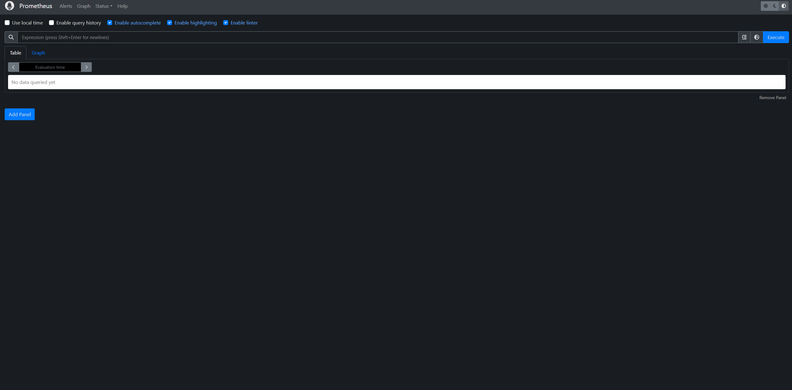
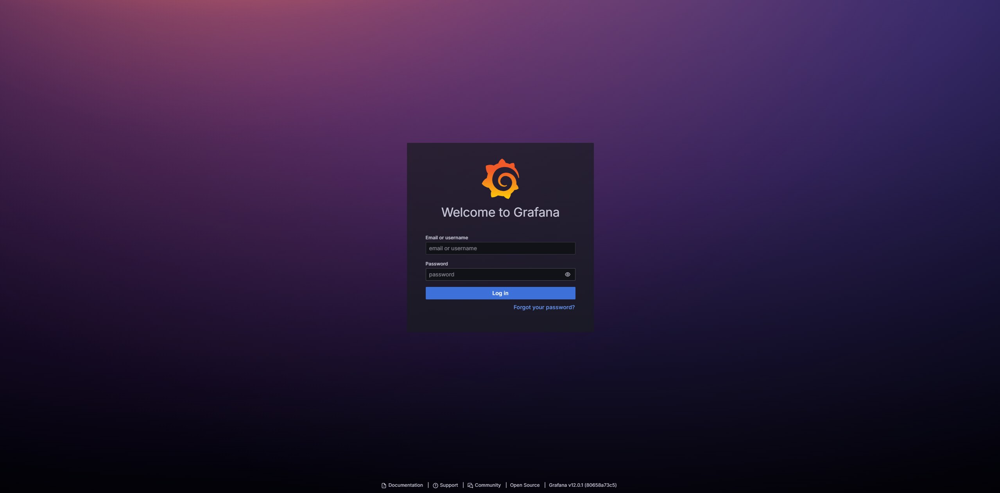
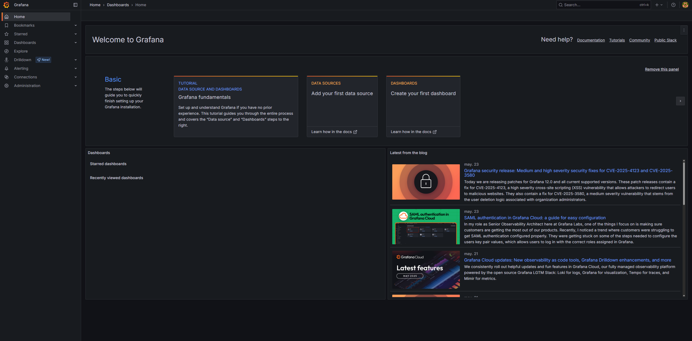

# DESIGN PHASE

## Architecture

System architecture model  
Components participating in the complete system.

The monitoring system is structured using a distributed approach in which services are centralized on a main virtual machine, while monitored systems operate as remote nodes exposing their metrics.

The main virtual machine runs Ubuntu Server, selected for its lightweight nature and compatibility with the tools used. The monitored nodes, on the other hand, may use a desktop version such as Ubuntu Desktop, which allows more varied metric visualization due to background processes.

The following components are deployed on the main virtual machine:

- Prometheus, responsible for metrics collection and storage.
- Grafana, used for data visualization and graphical analysis.
- Alertmanager, responsible for sending alerts when critical values are detected.
- Required configuration files to integrate all services.

The network architecture is designed to facilitate web browser access to the main services. In the context of a local deployment using VirtualBox, specific port forwarding is not required. However, in a future cloud deployment, it would be necessary to ensure access to the following ports (which are also used locally):

- Port 22: SSH access to the virtual machine for administration tasks.
- Port 3000: Access to the Grafana web interface.
- Port 9090: Access to the Prometheus interface.
- Port 9093: Access to the Alertmanager panel.
- Port 9100: Node Exporter metrics exposure (this port should only be accessible from the main VM’s IP address).

Node Exporter is installed on each monitored node to expose system metrics, which Prometheus then collects and processes.

Access to services is performed via web browser within the local network by entering the IP address of the main machine and the corresponding service port.

## Use Cases

Users, roles, or actors participating in the system:

- Administrator user (me): Full access to the system. Can create and modify dashboards, manage users, and edit Grafana’s global configuration. This role is reserved for the solution integrator.

- Editor user (technician): Can create, modify, and delete dashboards, but cannot change the system’s global configuration or manage users. Intended for the company’s technical staff.

- Viewer user: Can only view dashboards predefined by the administrator or editor. Intended for use by different company departments depending on their needs.

## User Interfaces

If there is any type of user interface, whether GUI or CLI.

The system provides graphical web interfaces accessible via a web browser, used for configuration, visualization, and service supervision.

**Prometheus Interface:**

  

**Grafana Login:**

**Grafana Interface:** 

**Alertmanager Interface:**

## Deployment Diagram

## Configuration Files

- [**Prometheus.yml**](../../src/prometheus.yml)

- [**Grafana.ini**](../../src/grafana.ini)

- [**Alertmanager.yml**](../../src/alertmanager.yml)

- [**Alert_rules.yml**](../../src/alert_rules.yml)
