# IMPLEMENTATION PHASE

## Deployment

### VirtualBox Installation

**a) Download and installation**

Go to the official [VirtualBox](https://www.virtualbox.org/wiki/Downloads/) website and download the version corresponding to the host system. In this case, VirtualBox 7.1.8 for Windows was used along with the Extension Pack of the same version.

Once the installer is downloaded, proceed with the default installation.

---

### Virtual Machine 1: Monitoring Server

This machine hosts Prometheus, Grafana, and Alertmanager.

- **Name**: VM-Monitoring
- **Guest operating system**: Ubuntu Server 24.04 LTS (64-bit)
- **RAM**: 4 GB
- **Processors**: 2 vCPU
- **Disk**: 35 GB, VDI format, dynamically allocated storage
- **Network adapter**: Bridged Adapter
- **Exposed ports**:
  - 3000 (Grafana)
  - 9090 (Prometheus)
  - 9093 (Alertmanager)

> This machine contains the core of the monitoring system. Prometheus and Grafana can be accessed from the host browser or from the local network.

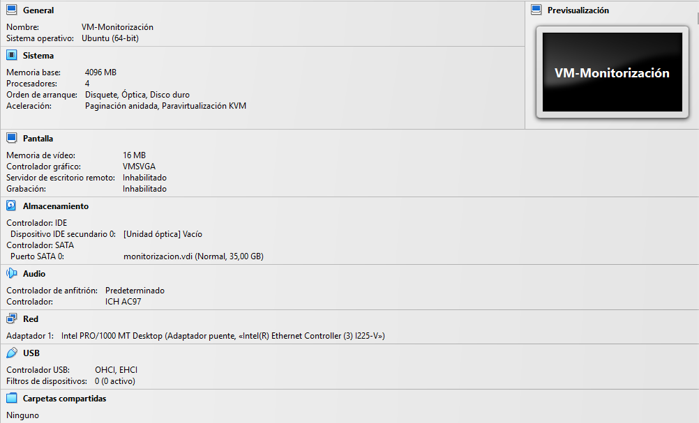

---

### Virtual Machine 2: Monitored Machine

This machine only runs **Node Exporter**.

- **Name**: VM-Monitored
- **Guest operating system**: Ubuntu Desktop 24.04 LTS (64-bit)
- **RAM**: 1 GB
- **Processors**: 1 vCPU
- **Disk**: 15 GB, VDI format, dynamically allocated storage
- **Network adapter**: Bridged Adapter

> Node Exporter was configured to listen on port 9100 and be detected by Prometheus running on the main VM.

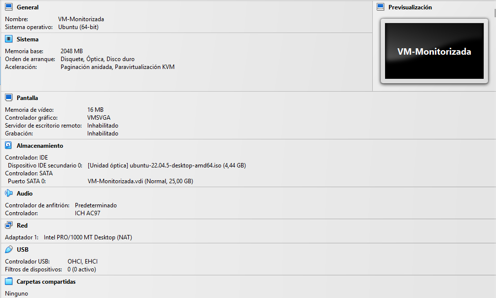

---

### Prometheus Installation

**a) Binary download**

Prometheus is distributed as a compiled binary. The official version 2.50 was [downloaded](https://prometheus.io/download/) from the GitHub repository (the download page is the official Prometheus site, but the files are hosted in GitHub repos), extracted, and moved to `/opt/prometheus` to keep application files centralized.

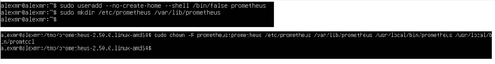

**b) Creating the user and directories**

Creating a user with no shell access and no home directory reduces security risks:
Prometheus only runs its own processes, without login privileges. The directories `/etc/prometheus` (configuration) and `/var/lib/prometheus` (data) are created to separate configuration from persistent data, assigning ownership to the Prometheus user.

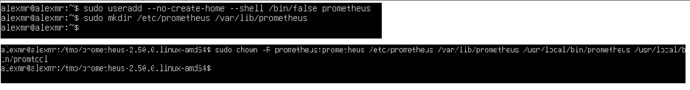

**c) Copying executables**

Placing executables in `/usr/local/bin` allows them to be executed easily from any path. Ownership is limited to the Prometheus user for security.

**d) Copying consoles and configuration**

These folders contain templates and console resources for the Prometheus web UI. They are moved to `/etc/prometheus` for centralized management.

**e) Copying the main configuration file**

The `prometheus.yml` file defines the jobs to monitor (targets), intervals, and alerts.
Placing it in `/etc/prometheus` makes centralized management easier and allows backups to be created easily.

**f) Editing prometheus.yml**

This file defines which services and instances will be monitored. The example includes Prometheus itself.

**g) Creating the systemd service**

Creating a systemd service allows Prometheus to be managed as a system service:
automatic startup, restart after failures, log control, etc.
The `Service` block defines the user, binary execution, and configuration paths.

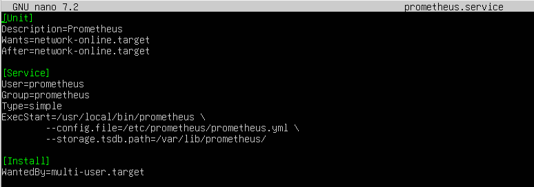

**h) Enabling the service**

`daemon-reload` updates systemd after adding or modifying a service.
`enable --now` enables and starts the service so it launches at boot and starts working immediately.

**Structure:**

`/opt/prometheus` → Original binaries (base folder)  
`/usr/local/bin` → Executables available system-wide  
`/etc/prometheus` → Configuration files  
`/var/lib/prometheus` → Prometheus database

---

### Node Exporter Installation

**a) Binary download**

As with Prometheus, the official version 1.7.0 is downloaded from GitHub and extracted to access the executable.

**b) Binary installation**

The `node_exporter` binary is placed in `/usr/local/bin` so it can be executed from anywhere.

**c) User creation**

Create a user without shell access and without a home directory to improve security. In other words, if something goes wrong, it affects only that user and not the entire system.

**d) Creating the systemd service**

systemd is configured so the service starts at boot and can be managed (start/stop/restart) using standard Linux tools, and so it runs as `node_exporter` for security reasons.

---

### Grafana Installation

**a) Repository configuration**

Basic utilities are installed to handle secure repositories. The GPG key and the official [Grafana repository](https://grafana.com/docs/grafana/latest/setup-grafana/installation/debian/) are added.

**b) Installation and activation**

Repositories are updated (`apt update`), the software is installed (`apt install`), and the service is started and enabled (`enable --now`) so it runs at system startup.

---

### Alertmanager Installation

**a) Download and installation**

A similar process to Prometheus is followed to ensure security, separate permissions, and keep a clean directory structure.

  

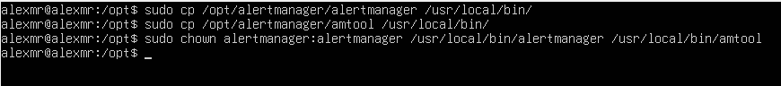

**b) Creating the systemd service**

For automatic startup and standard service management (start/stop/restart).

**c) Enabling the service**

For continuous execution.

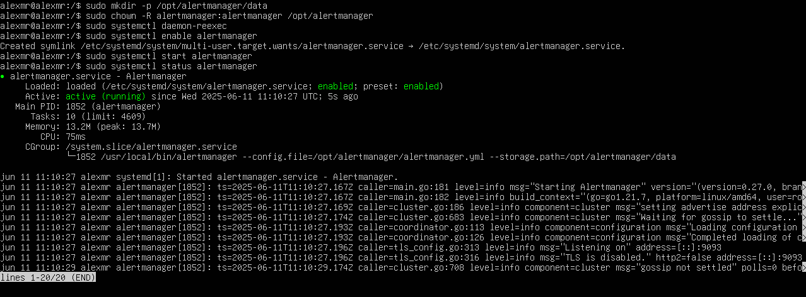  

**d) Prometheus configuration**

This enables communication between Prometheus and Alertmanager to manage and send alerts.

---

### Node Exporter Configuration

**a) Adding a target**

In the `prometheus.yml` file, add the target at the end with the IP address from which metrics will be scraped.

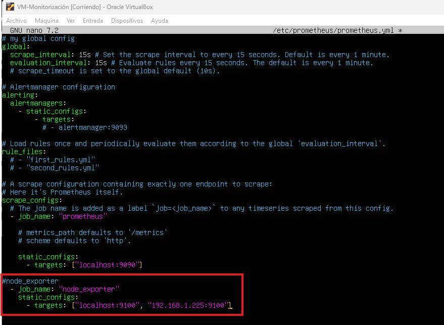  

**b) Checking targets**

After adding targets, access `prometheus/targets` from the browser to verify that scraping works correctly.

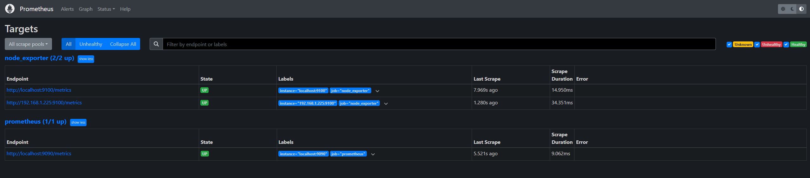

---

### Grafana Configuration

**a) Add data source**

Once all tools are installed, add the data source from which metrics will be displayed.

  

**b) Add Prometheus as the source**

  

**c) Add target IPs**

In this step, add the IP address of the targets to visualize (in this case, the VM-Monitored IP).

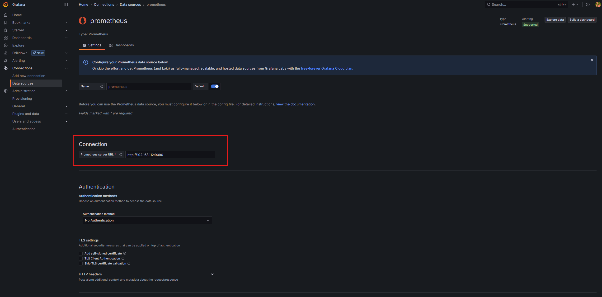

---

### Dashboards

Once Node Exporter is scraping target metrics and Grafana has Prometheus configured as a data source, you can create a dashboard to visualize the information.

**a) New dashboard**

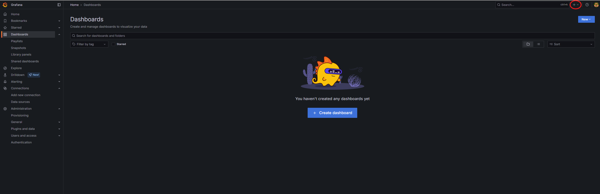

**b) Import dashboard**

This tab provides options to import specific panels/dashboards or create custom ones from scratch.

  

**c) Add dashboard ID**

There are many dashboards for different exporters on the official [Grafana dashboards page](https://grafana.com/grafana/dashboards/).  
Once you find the dashboard you need, copy its ID and paste it into the import dashboard section.

**d) Preview**

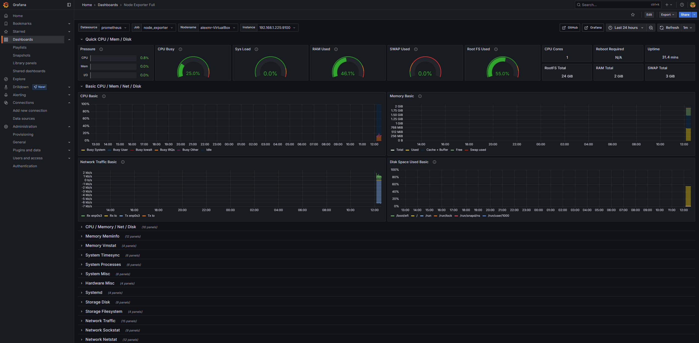

---

### Alertmanager Configuration

**a) Add Alertmanager**

Once Alertmanager is running correctly (verified with `systemctl status alertmanager`), it can be added in `prometheus.yml` as `localhost` (since it is on the same machine) on port 9093.

**b) Restart the service**

When configuration changes are made, the service must be restarted for changes to apply.

**c) Verification**

From the browser, access `/status` and confirm Alertmanager appears as an endpoint to verify correct configuration.

---

### Creating Alerts

> Note: To receive emails in Gmail, 2-step verification must be enabled on the receiving account.

**a) Create an app password**

To send alert emails, it is recommended to create an app password instead of using the main account password. To do so, sign in to Google’s [App Passwords page](https://myaccount.google.com/apppasswords).

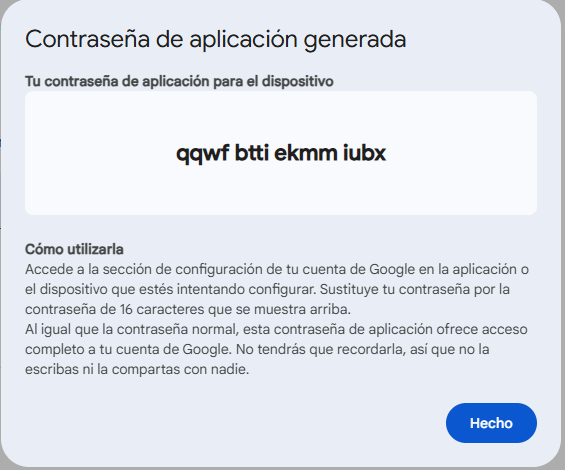

**b) Configure the Alertmanager file**

In `alertmanager.yml`, add Gmail’s SMTP server, the account email, and the generated app password. Also add `send_resolved: true` so another email is sent when the alert is resolved, which greatly helps tracking.

**c) Create the alert rule**

Next, create a file where the rules that trigger alerts are defined, in this case CPU usage. If desired, you can use `vector(1)` so the alert fires immediately without criteria, to verify that notification channels work.

**d) Add it to Prometheus**

**e) Verification**

If the rules were added correctly, they can be checked in Prometheus at `/rules`.

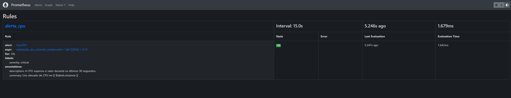

---

### Tests

**a) Alert with vector(1)**

Before testing CPU-based alerts, it is useful to use the `vector(1)` expression to confirm that emails arrive, and then ensure CPU-based alerts work as well.

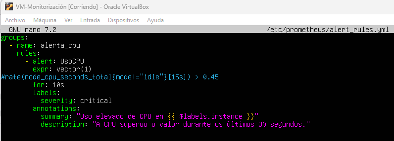

Using this expression means the rule is always considered true; therefore, check Prometheus at `/alert`, as well as email and the Alertmanager interface.

Both Alertmanager and Prometheus reported the alert and it reached the destination email account. With this baseline, testing with real CPU values can begin.

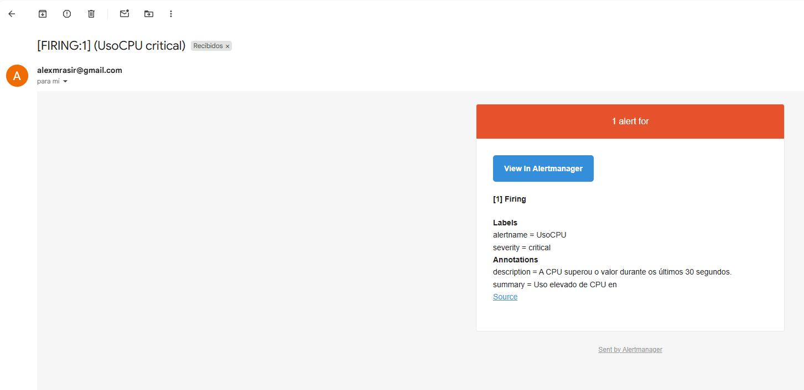

**b) CPU alert**

To verify the CPU usage alert, the ideal approach is to set low thresholds to confirm Node Exporter is exposing data correctly, and that the alert is detected and notified according to the configured `for`/evaluation time.

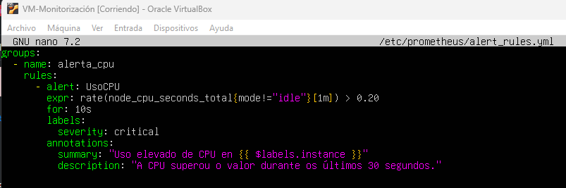

Since the CPU threshold was set very low, it triggers almost immediately and is again notified by Prometheus/Alertmanager and reaches email.

After CPU values return to normal, another email is sent indicating the alert was resolved.

---

## Technical Manual

### Installation-related information:

> The elements used in the development of the project are detailed below.

#### Hardware elements

- **Processor**: Intel Core i7-12700K
- **Motherboard**: ASUS TUF GAMING Z690-PLUS WIFI D4
- **RAM**: Corsair Vengeance LPX DDR4 3200MHz 32GB (2x16GB) CL16
- **Graphics card**: Nvidia GeForce RTX 3060 12GB
- **Primary storage**: Kingston FURY Renegade 2TB SSD NVMe PCIe 4.0 M.2 Gen4
- **Secondary storage**: Kioxia Exceria G2 1TB SSD NVMe M.2 2280
- **Cooling**: Tempest Liquid Cooler 360
- **Power supply**: Corsair RMx RM1000x 1000W

---

#### Software elements

- **Operating system**:
  - Ubuntu Server 24.04 LTS (used version)

- **Virtualization software**:
  - **Oracle VM VirtualBox 7.1.8**

- **Main software**:
  - **Prometheus v2.50** – Collects and stores system and service metrics
  - **Node Exporter v1.7.0** – Hardware and OS metrics exporter
  - **Grafana v10.4.2** – Data visualization platform
  - **Alertmanager v0.27.0** – Alert management and notification service

- **External software/services it interacts with**:
  - Notification systems (email, Slack, Telegram, etc.) through Alertmanager configuration

---

#### Users

##### Initial security configuration

- **Service users**: Dedicated accounts were created for each service, without shell access or home directory. This prevents interactive login and keeps permissions to a minimum.

- **Network access**: Machines are configured in bridged mode to allow direct communication between them within the same network. Only required ports are used for each service (9090, 3000, 9093, 9100).

---

##### System users

The **VM-Monitoring** machine is the only one with a main administrator user, restricted to admin-only maintenance tasks. Services run exclusively under their respective restricted users.

---

##### Application users

- **Grafana**: The default admin user is configured and its password is changed on first login to a stronger one. Additional accounts can be created with specific permissions (view, edit, etc.).

- **Other services**: They do not provide user management in the web interface, so access control relies on network configuration and/or external services.

---

#### Deployment

## Incident Management

#### 1. System incidents

- **Service outage**: Prometheus, Grafana, or Alertmanager may stop working due to configuration errors or resource usage.
  - Detection: automatic alerts and commands such as `systemctl status` or `journalctl`.
  - Solution: restart the affected service or review the corresponding error logs.

- **Unauthorized access**: Unauthorized access attempts to Grafana or Alertmanager web interfaces.
  - Prevention: strong passwords and role-based user management.
  - Detection: review access logs or enable alerts for repeated failed attempts.
  - Solution: restrict access by IP, change passwords, or review security configuration.

- **Network/connectivity issues**: Failures in communication between Prometheus and exporters.
  - Detection: missing metrics or "target down" alerts.
  - Solution: verify connectivity, review `prometheus.yml`, and confirm the exporter is running.

---

#### 2. Software incidents

Related to logical system behavior or configuration errors:

- **Prometheus or Alertmanager configuration error**:
  - Detection: Prometheus fails to start or shows validation errors.
  - Solution: review `prometheus.yml` or `alertmanager.yml` using `promtool check config`.

- **Grafana visualization issues**:
  - Dashboards do not load or show outdated data.
  - Solution: ensure Prometheus is correctly configured as a data source and queries are correct.

- **Misconfigured alerts**:
  - Alerts do not fire or send incorrect notifications.
  - Solution: review alert rules and confirm Alertmanager is running and properly linked.

---

### General incident management procedure

1. **Incident detection**: via configured alerts, metric review, or direct supervision.
2. **Error analysis**: check system logs (`journalctl`), review configuration files, verify service status.
3. **Resolution**: apply the corresponding fix depending on the incident type.
4. **Incident documentation**: manual logging (or a future automated system) including root cause, actions taken, and outcome.
